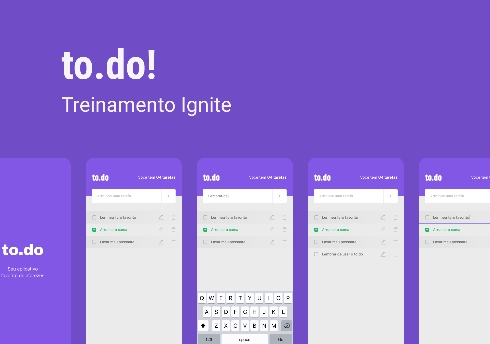

# [Simple To.do App](https://www.figma.com/file/UBKawgIJz8wKWKFCKLB3OE/To.do?node-id=10485%3A499)


 


<p align="center">
  
</p>

---

## About the project <a id="en_us"></a>

[To.do App](https://www.figma.com/file/UBKawgIJz8wKWKFCKLB3OE/To.do?node-id=10485%3A499) Simple application made in React Native using TypeScript. The idea was seen as a challenge for the Rocketseat Ignite course.
I will now implement integration with firebase for database storage, creation of an icon and launch in Play Store for educational purposes.

## Content
* [Technologies used](#technologies)
* [How to run the project](#installation)
* [Installation - Front-end](#installation-front)

## Technologies used <a id="technologies"></a>

- [x] React
- [x] Typescript
- [-] Firestore
- [-] Firebase Auth
- [x] react-native-iphone-x-helper
- [x] react-native-linear-gradient
- [x] react-native-vector-icons

## How to execute the project <a id="installation"></a>
To execute the project, you'll need to have Node and NPM or Yarn installed to setup all the dependencies.
You will also need to have an android or ios emulator installed. 
For Android I recommend Android Studio and for iOS there is only Xcode possible.
Java JDK 8 at least, Node.JS, npm and yarn;


### Installation - Front-end (Web) <a id="installation-front"></a>

In the project root folder:

```bash
npm install
npm run start
```

If you are using Yarn, use this:
```bash
yarn install
yarn start
```

After completing the installation and running ``yarn start`` or ``npm run start`` the application will run in your browser.

---
###### Developed on Ignite from [Rocketseat](https://rocketseat.com.br) by [Vinicius Petrachin](https://www.linkedin.com/in/petrachin/)
